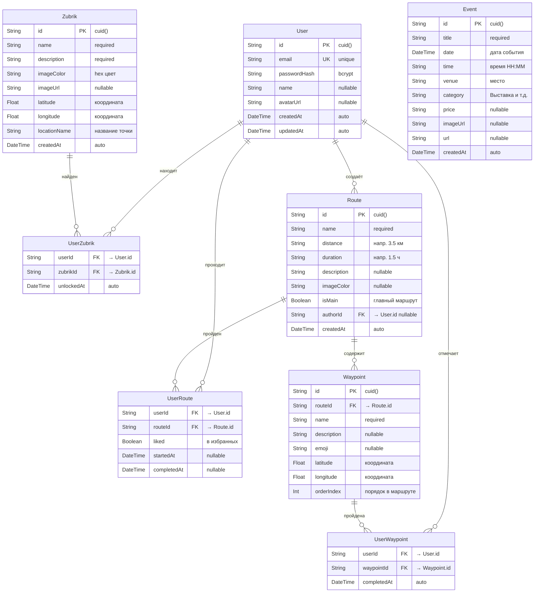
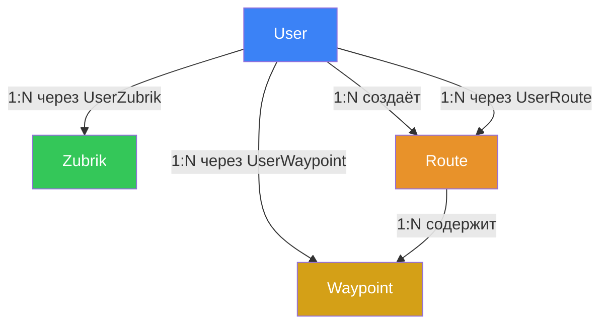

# 🗄️ Архитектура Базы Данных — Zubriks

## Содержание
- [Обзор](#обзор)
- [Технологический стек](#технологический-стек)
- [ER-диаграмма](#er-диаграмма)
- [Модели данных](#модели-данных)
- [Связи между моделями](#связи-между-моделями)
- [Поток данных: Backend → Frontend](#поток-данных-backend--frontend)
- [API-эндпоинты (tRPC)](#api-эндпоинты-trpc)
- [Индексы и производительность](#индексы-и-производительность)
- [Каскадное удаление](#каскадное-удаление)
- [Миграции](#миграции)
- [Seed-данные](#seed-данные)
- [Команды для работы с БД](#команды-для-работы-с-бд)

---

## Обзор

База данных проекта Zubriks хранит всю информацию для интерактивного пешеходного гида по городу Орёл:
персонажи-Зубрики, городские события, экскурсионные маршруты с точками, а также данные пользователей
и их прогресс (какие Зубрики найдены, какие маршруты пройдены).

**Ключевой принцип**: вся пользовательская активность (`unlocked`, `liked`, `completed`) хранится
в отдельных связующих таблицах, а не в самих сущностях. Это позволяет каждому пользователю иметь
свой независимый прогресс.

---

## Технологический стек

| Компонент | Технология | Файл |
|-----------|------------|------|
| СУБД | PostgreSQL 16 (Alpine) | [docker-compose.yml](file:///home/invigar/IT/Development/Zubriks/docker-compose.yml) |
| ORM | Prisma 6.x | [schema.prisma](file:///home/invigar/IT/Development/Zubriks/backend/prisma/schema.prisma) |
| Клиент | @prisma/client (singleton) | [prisma.ts](file:///home/invigar/IT/Development/Zubriks/backend/src/prisma.ts) |
| API | tRPC (type-safe RPC) | [trpc.ts](file:///home/invigar/IT/Development/Zubriks/backend/src/trpc.ts) |
| Инфраструктура | Docker Compose | Контейнер `zubriks-db`, volume `zubriks-pgdata` |
| Подключение | `DATABASE_URL` | [backend/.env](file:///home/invigar/IT/Development/Zubriks/backend/.env) |

### Prisma Client Singleton

Файл [prisma.ts](file:///home/invigar/IT/Development/Zubriks/backend/src/prisma.ts) реализует паттерн singleton:
один экземпляр `PrismaClient` переиспользуется между hot-reload'ами в dev-режиме (`tsx watch`),
чтобы не исчерпывать пул соединений PostgreSQL.

```typescript
const globalForPrisma = globalThis as unknown as { prisma: PrismaClient | undefined }
export const prisma = globalForPrisma.prisma ?? new PrismaClient({ ... })
if (process.env.NODE_ENV !== 'production') globalForPrisma.prisma = prisma
```

---

## ER-диаграмма



---

## Модели данных

### 1. User — Пользователь

> Хранит учётные данные. Сейчас авторизация по email + пароль, в будущем — OAuth (VK, Yandex).

| Поле | Тип | Описание |
|------|-----|----------|
| `id` | `String` (cuid) | Первичный ключ |
| `email` | `String` (unique) | Электронная почта — уникальна |
| `passwordHash` | `String` | Хеш пароля (bcrypt) |
| `name` | `String?` | Отображаемое имя |
| `avatarUrl` | `String?` | URL аватарки |
| `createdAt` | `DateTime` | Дата регистрации (auto) |
| `updatedAt` | `DateTime` | Дата последнего обновления (auto) |

**Связи:**
- `unlockedZubriks` → `UserZubrik[]` — какие зубрики найдены
- `routeInteractions` → `UserRoute[]` — какие маршруты пройдены/лайкнуты
- `completedWaypoints` → `UserWaypoint[]` — какие точки отмечены
- `createdRoutes` → `Route[]` — какие маршруты создал

---

### 2. Zubrik — Коллекционный персонаж

> Привязан к конкретной GPS-точке на карте города Орёл.

| Поле | Тип | Описание |
|------|-----|----------|
| `id` | `String` (cuid) | Первичный ключ |
| `name` | `String` | Имя зубрика (напр. «Зубрик-Путешественник») |
| `description` | `String` | Подробное описание персонажа |
| `imageColor` | `String` | HEX-цвет фона карточки (напр. `#CEE6B6`) |
| `imageUrl` | `String?` | Путь к изображению (напр. `/images/Zubrik-1-Travel.png`) |
| `latitude` | `Float` | Широта GPS-координаты |
| `longitude` | `Float` | Долгота GPS-координаты |
| `locationName` | `String` | Название точки (напр. «Парк Культуры») |
| `createdAt` | `DateTime` | Дата создания (auto) |

> [!IMPORTANT]
> В прежней версии координаты хранились как кортеж `[number, number, string]`.
> Теперь они разбиты на 3 отдельных поля (`latitude`, `longitude`, `locationName`)
> для типобезопасности, индексации и удобства гео-запросов.
> API собирает их обратно в кортеж для обратной совместимости с фронтендом.

---

### 3. Event — Городское событие

> Мероприятия города Орёл (выставки, концерты, фестивали).

| Поле | Тип | Описание |
|------|-----|----------|
| `id` | `String` (cuid) | Первичный ключ |
| `title` | `String` | Название события |
| `date` | `DateTime` | Дата проведения |
| `time` | `String` | Время начала (строка, напр. `"14:00"`) |
| `venue` | `String` | Место проведения |
| `category` | `String` | Категория (Выставка, Концерт, Фестиваль...) |
| `price` | `String?` | Цена (напр. `"200 ₽"` или `"Бесплатно"`) |
| `imageUrl` | `String?` | URL изображения. Если `null` — фронтенд показывает дефолтный эмодзи |
| `url` | `String?` | Ссылка на страницу события |
| `createdAt` | `DateTime` | Дата создания записи (auto) |

---

### 4. Route — Маршрут

> Экскурсионный маршрут с набором точек (Waypoints).

| Поле | Тип | Описание |
|------|-----|----------|
| `id` | `String` (cuid) | Первичный ключ |
| `name` | `String` | Название маршрута |
| `distance` | `String` | Дистанция (напр. `"3.5 км"`) |
| `duration` | `String` | Продолжительность (напр. `"1.5 ч"`) |
| `description` | `String?` | Описание маршрута |
| `imageColor` | `String?` | HEX-цвет карточки маршрута |
| `isMain` | `Boolean` | `true` = главный тур «Зубрики» |
| `authorId` | `String?` | FK → User (создатель маршрута) |
| `createdAt` | `DateTime` | Дата создания (auto) |

> [!NOTE]
> Поле `stops` (количество остановок) **не хранится** в БД —
> оно вычисляется через `waypoints._count` в Prisma-запросе.
> Это исключает рассинхронизацию между числом и реальным количеством точек.

> [!NOTE]
> Ранее `mainRoute` был отдельным объектом в коде. Теперь это обычный Route
> с флагом `isMain: true`. API фильтрует маршруты по этому флагу.

---

### 5. Waypoint — Точка маршрута

> Конкретная GPS-точка внутри маршрута с гарантированным порядком.

| Поле | Тип | Описание |
|------|-----|----------|
| `id` | `String` (cuid) | Первичный ключ |
| `routeId` | `String` | FK → Route (к какому маршруту принадлежит) |
| `name` | `String` | Название точки (напр. «Площадь Ленина») |
| `description` | `String?` | Описание |
| `emoji` | `String?` | Эмодзи-иконка (🏛️, 🌳, 🦬...) |
| `latitude` | `Float` | Широта |
| `longitude` | `Float` | Долгота |
| `orderIndex` | `Int` | Порядковый номер в маршруте (0, 1, 2...) |

> [!IMPORTANT]
> `orderIndex` гарантирует правильный порядок точек при отображении маршрута.
> Запросы всегда используют `orderBy: { orderIndex: 'asc' }`.

---

### 6–8. Связующие таблицы (Junction Tables)

Эти таблицы реализуют связи **многие-ко-многим** между пользователями и контентом.

#### UserZubrik — «Пользователь нашёл Зубрика»

| Поле | Тип | Описание |
|------|-----|----------|
| `userId` | `String` | FK → User |
| `zubrikId` | `String` | FK → Zubrik |
| `unlockedAt` | `DateTime` | Когда Зубрик был найден (auto) |

**Composite PK**: `(userId, zubrikId)` — один пользователь может найти одного зубрика только один раз.

#### UserRoute — «Пользователь взаимодействует с маршрутом»

| Поле | Тип | Описание |
|------|-----|----------|
| `userId` | `String` | FK → User |
| `routeId` | `String` | FK → Route |
| `liked` | `Boolean` | В избранном (`false` по умолчанию) |
| `startedAt` | `DateTime?` | Когда начал прохождение |
| `completedAt` | `DateTime?` | Когда завершил маршрут |

**Composite PK**: `(userId, routeId)`

#### UserWaypoint — «Пользователь прошёл точку маршрута»

| Поле | Тип | Описание |
|------|-----|----------|
| `userId` | `String` | FK → User |
| `waypointId` | `String` | FK → Waypoint |
| `completedAt` | `DateTime` | Когда точка была пройдена (auto) |

**Composite PK**: `(userId, waypointId)`

---

## Связи между моделями



| Связь | Тип | Описание | ON DELETE |
|-------|-----|----------|-----------|
| User → UserZubrik | 1:N | Какие зубрики найдены | CASCADE |
| Zubrik → UserZubrik | 1:N | Кем найден зубрик | CASCADE |
| User → UserRoute | 1:N | Взаимодействие с маршрутами | CASCADE |
| Route → UserRoute | 1:N | Кем пройден маршрут | CASCADE |
| User → UserWaypoint | 1:N | Какие точки отмечены | CASCADE |
| Waypoint → UserWaypoint | 1:N | Кем пройдена точка | CASCADE |
| User → Route | 1:N | Автор маршрута | SET NULL |
| Route → Waypoint | 1:N | Точки в маршруте | CASCADE |

---

## Поток данных: Backend → Frontend

Prisma хранит данные в нормализованном виде, но API трансформирует их
в формат, который ожидает фронтенд:

```
┌──────────────────────────────┐
│         PostgreSQL            │
│  latitude: 52.9701            │
│  longitude: 36.0732           │
│  locationName: "Парк Культуры"│
└──────────┬───────────────────┘
           │ Prisma query
           ▼
┌──────────────────────────────┐
│     tRPC (backend/src/trpc.ts)│
│  Трансформация:               │
│  coordinates: [               │
│    52.9701,                   │
│    36.0732,                   │
│    "Парк Культуры"            │
│  ]                            │
│  unlocked: false (пока)       │
│  stops: _count.waypoints      │
└──────────┬───────────────────┘
           │ HTTP JSON-RPC
           ▼
┌──────────────────────────────┐
│       Frontend (React)        │
│  coordinates: [num, num, str] │
│  distance: calculateDistance()│
│  — вычисляется на клиенте     │
└──────────────────────────────┘
```

### Что вычисляется на стороне клиента (не хранится в БД):
- **`distance`** — расстояние от пользователя до Зубрика (формула Гаверсинусов)
- **`unlocked`** — пока всегда `false` (до реализации авторизации)
- **`liked`** — пока всегда `false`
- **`completed`** — пока всегда `false`

---

## API-эндпоинты (tRPC)

### `getZubriks` — Получить всех Зубриков

```
Query: prisma.zubrik.findMany({ orderBy: { createdAt: 'asc' } })

Response: {
  zubriks: [{
    id, name, description, distance: "",
    unlocked: false, imageColor, imageUrl,
    coordinates: [latitude, longitude, locationName]
  }]
}
```

### `getEvents` — Получить события

```
Query: prisma.event.findMany({ orderBy: [{ date: 'asc' }, { time: 'asc' }] })

Response: {
  events: [{
    id, title, date (ISO), time, venue,
    category, price, imageUrl, url
  }]
}
```

### `getRoutes` — Получить маршруты

```
Query:
  routes = prisma.route.findMany({
    where: { isMain: false },
    include: { author: { select: { name } }, _count: { select: { waypoints } } }
  })
  mainRoute = prisma.route.findFirst({ where: { isMain: true }, ... })

Response: {
  routes: [{ id, name, distance, duration, stops, author, description, liked, imageColor }],
  mainRoute: { id, name, distance, duration, stops, description }
}
```

### `getRouteWaypoints` — Получить точки маршрута

```
Input: { routeId: string }
Query: prisma.waypoint.findMany({ where: { routeId }, orderBy: { orderIndex: 'asc' } })

Response: {
  waypoints: [{
    id, name, description, emoji,
    latitude, longitude, orderIndex,
    completed: false
  }]
}
```

---

## Индексы и производительность

| Индекс | Таблица | Поле(я) | Тип | Зачем |
|--------|---------|---------|-----|-------|
| `User_email_key` | User | email | UNIQUE | Быстрый поиск при авторизации |
| `User_pkey` | User | id | PK | Первичный ключ |
| `Zubrik_pkey` | Zubrik | id | PK | Первичный ключ |
| `Event_pkey` | Event | id | PK | Первичный ключ |
| `Route_pkey` | Route | id | PK | Первичный ключ |
| `Waypoint_pkey` | Waypoint | id | PK | Первичный ключ |
| `Waypoint_routeId_idx` | Waypoint | routeId | INDEX | Быстрая выборка точек по маршруту |
| `UserZubrik_pkey` | UserZubrik | (userId, zubrikId) | Composite PK | Уникальность + быстрый lookup |
| `UserRoute_pkey` | UserRoute | (userId, routeId) | Composite PK | Уникальность + быстрый lookup |
| `UserWaypoint_pkey` | UserWaypoint | (userId, waypointId) | Composite PK | Уникальность + быстрый lookup |

---

## Каскадное удаление

Все связующие таблицы используют `ON DELETE CASCADE`:

- Удаление **User** → автоматически удаляются все его `UserZubrik`, `UserRoute`, `UserWaypoint`
- Удаление **Zubrik** → автоматически удаляются все связи `UserZubrik`
- Удаление **Route** → автоматически удаляются все `Waypoint` и `UserRoute`
- Удаление **Waypoint** → автоматически удаляются все `UserWaypoint`

Исключение: удаление User **не удаляет** созданные им маршруты (`ON DELETE SET NULL` на `Route.authorId`).

---

## Миграции

Миграции хранятся в `backend/prisma/migrations/` и управляются Prisma Migrate.

| Миграция | Дата | Описание |
|----------|------|----------|
| `20260618154639_init` | 18.06.2026 | Создание всех 8 таблиц, индексов и FK |

Файл миграции: [migration.sql](file:///home/invigar/IT/Development/Zubriks/backend/prisma/migrations/20260618154639_init/migration.sql)

---

## Seed-данные

Seed-скрипт ([seed.ts](file:///home/invigar/IT/Development/Zubriks/backend/prisma/seed.ts)) заполняет БД начальными данными:

| Модель | Количество записей | Примечание |
|--------|--------------------|------------|
| Zubrik | 6 | Все 6 персонажей с координатами в Орле |
| Event | 6 | События на 3–5 июля 2026 |
| Route | 5 | 1 главный (`isMain: true`) + 4 обычных |
| Waypoint | 5 | Точки главного маршрута «Тур Зубрики» |

Главный маршрут создаётся с вложенными waypoints через Prisma `nested create`,
что гарантирует целостность FK.

---

## Команды для работы с БД

```bash
# Инфраструктура
pnpm db:up          # Запустить PostgreSQL в Docker
pnpm db:down        # Остановить PostgreSQL

# Prisma
pnpm db:migrate     # Применить миграции (prisma migrate dev)
pnpm db:seed        # Заполнить БД данными
pnpm db:reset       # Полный сброс: drop → migrate → seed
pnpm db:studio      # Открыть Prisma Studio (веб-GUI для БД)

# Бэкенд-специфичные (из backend/)
pnpm b db:generate  # Перегенерировать Prisma Client после изменений схемы
pnpm b db:push      # Применить схему без создания миграции (для прототипирования)
```
