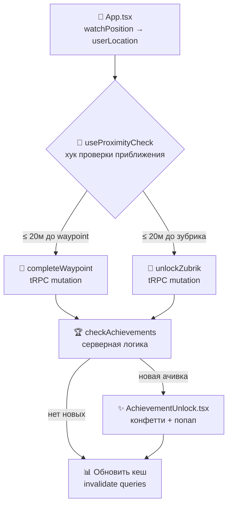

# 🎮 Инструкция: Реализация геймификации (GPS-трекинг прогресса)

> **Цель**: Точка маршрута / Зубрик считается «взятым», если GPS-координаты пользователя находятся в радиусе **20 метров**. Прогресс сохраняется в БД, а при достижении определённых условий автоматически выдаются ачивки.

---

## 📊 Текущее состояние (что уже есть)

| Компонент | Что есть | Чего не хватает |
|-----------|----------|-----------------|
| **`distance.ts`** | Расчёт расстояния Haversine, возвращает строку (`"150м"`) | Нет числовой версии для сравнения с порогом |
| **`App.tsx`** | `userLocation` обновляется через `watchPosition` в реальном времени | Нет логики проверки приближения |
| **`RouteActive.tsx`** | Отображает точки маршрута, `completed` приходит с сервера | Нет механизма отметки точки как пройденной |
| **`MapScreen.tsx`** | Показывает зубриков на карте | Нет автоматического «подбора» зубрика при приближении |
| **Schema** | `UserWaypoint`, `UserZubrik`, `UserAchievement` — все связующие таблицы готовы | Нет эндпоинтов для записи прогресса |
| **`trpc.ts`** | `getRouteWaypoints` возвращает `completed` из `UserWaypoint` | Нет мутаций `completeWaypoint`, `unlockZubrik`, `checkAchievements` |
| **`AchievementUnlock.tsx`** | Полноценный UI с конфетти | Вызывается только 1 раз при онбординге, не привязан к реальным ачивкам |
| **`seed.ts`** | 8 ачивок в БД с описаниями | Нет системы проверки условий для каждой ачивки |

---

## 🏗️ Архитектура решения



---

## 📝 План реализации (5 этапов)

### Этап 1: Утилита расстояния (числовая версия)

**Файл**: [distance.ts](file:///home/invigar/IT/Development/Zubriks/frontend/src/app/utils/distance.ts)

Добавить функцию `calculateDistanceRaw` — возвращает расстояние **в метрах как число** (для сравнения с порогом 20м). Текущая `calculateDistance` возвращает строку и не подходит для программной проверки.

```ts
/** Расстояние в метрах (число) для программных проверок */
export function calculateDistanceRaw(lat1: number, lon1: number, lat2: number, lon2: number): number {
  const R = 6371000
  const dLat = ((lat2 - lat1) * Math.PI) / 180
  const dLon = ((lon2 - lon1) * Math.PI) / 180
  const a =
    Math.sin(dLat / 2) ** 2 +
    Math.cos((lat1 * Math.PI) / 180) * Math.cos((lat2 * Math.PI) / 180) * Math.sin(dLon / 2) ** 2
  return R * 2 * Math.atan2(Math.sqrt(a), Math.sqrt(1 - a))
}

export const PROXIMITY_RADIUS_METERS = 20
```

Также рефакторить `calculateDistance` чтобы она использовала `calculateDistanceRaw` внутри (DRY).

---

### Этап 2: Бэкенд — мутации для записи прогресса

**Файл**: [trpc.ts](file:///home/invigar/IT/Development/Zubriks/backend/src/trpc.ts)

#### 2.1 Мутация `completeWaypoint`

```ts
completeWaypoint: protectedProcedure
  .input(z.object({ waypointId: z.string() }))
  .mutation(async ({ input, ctx }) => {
    // 1. Проверяем, что waypoint существует
    const waypoint = await ctx.prisma.waypoint.findUnique({
      where: { id: input.waypointId },
      include: { route: true },
    })
    if (!waypoint) throw new TRPCError({ code: 'NOT_FOUND' })

    // 2. Записываем прогресс (upsert чтобы не падать при повторном вызове)
    await ctx.prisma.userWaypoint.upsert({
      where: { userId_waypointId: { userId: ctx.userId, waypointId: input.waypointId } },
      create: { userId: ctx.userId, waypointId: input.waypointId },
      update: {},
    })

    // 3. Проверяем, все ли точки маршрута пройдены → отмечаем маршрут как завершённый
    const totalWaypoints = await ctx.prisma.waypoint.count({ where: { routeId: waypoint.routeId } })
    const completedWaypoints = await ctx.prisma.userWaypoint.count({
      where: {
        userId: ctx.userId,
        waypoint: { routeId: waypoint.routeId },
      },
    })

    if (completedWaypoints >= totalWaypoints) {
      await ctx.prisma.userRoute.upsert({
        where: { userId_routeId: { userId: ctx.userId, routeId: waypoint.routeId } },
        create: { userId: ctx.userId, routeId: waypoint.routeId, completedAt: new Date(), startedAt: new Date() },
        update: { completedAt: new Date() },
      })
    }

    // 4. Проверяем ачивки
    const newAchievements = await checkAndAwardAchievements(ctx.prisma, ctx.userId)
    return { completed: true, routeCompleted: completedWaypoints >= totalWaypoints, newAchievements }
  }),
```

#### 2.2 Мутация `unlockZubrik`

```ts
unlockZubrik: protectedProcedure
  .input(z.object({ zubrikId: z.string() }))
  .mutation(async ({ input, ctx }) => {
    const zubrik = await ctx.prisma.zubrik.findUnique({ where: { id: input.zubrikId } })
    if (!zubrik) throw new TRPCError({ code: 'NOT_FOUND' })

    // Upsert — безопасно при повторном вызове
    await ctx.prisma.userZubrik.upsert({
      where: { userId_zubrikId: { userId: ctx.userId, zubrikId: input.zubrikId } },
      create: { userId: ctx.userId, zubrikId: input.zubrikId },
      update: {},
    })

    const newAchievements = await checkAndAwardAchievements(ctx.prisma, ctx.userId)
    return { unlocked: true, newAchievements }
  }),
```

#### 2.3 Серверная функция `checkAndAwardAchievements`

Определяется **вне** роутера, в том же файле (или в отдельном `achievements.ts`):

```ts
async function checkAndAwardAchievements(prisma: PrismaClient, userId: string) {
  const [zubrikCount, totalZubriks, completedRoutes, createdRoutes] = await Promise.all([
    prisma.userZubrik.count({ where: { userId } }),
    prisma.zubrik.count(),
    prisma.userRoute.count({ where: { userId, completedAt: { not: null } } }),
    prisma.route.count({ where: { authorId: userId } }),
  ])

  // Правила ачивок: { название_ачивки → условие }
  const rules: Record<string, boolean> = {
    'Начало пути':      zubrikCount >= 1,
    'Исследователь':    zubrikCount >= 5,
    'Коллекционер':     zubrikCount >= 10,
    'Легенда Орла':     zubrikCount >= totalZubriks && totalZubriks > 0,
    'Мастер маршрутов': createdRoutes >= 5,
  }

  // Получаем все ачивки из БД
  const allAchievements = await prisma.achievement.findMany()
  const existingUserAchievements = await prisma.userAchievement.findMany({
    where: { userId, earned: true },
    select: { achievementId: true },
  })
  const earnedIds = new Set(existingUserAchievements.map(a => a.achievementId))

  const newlyEarned: { id: string; name: string; description: string; emoji: string; imageUrl: string }[] = []

  for (const achievement of allAchievements) {
    if (earnedIds.has(achievement.id)) continue // уже получена
    const shouldEarn = rules[achievement.name]
    if (!shouldEarn) continue

    await prisma.userAchievement.upsert({
      where: { userId_achievementId: { userId, achievementId: achievement.id } },
      create: { userId, achievementId: achievement.id, earned: true, earnedAt: new Date(), progress: 100 },
      update: { earned: true, earnedAt: new Date(), progress: 100 },
    })

    newlyEarned.push({
      id: achievement.id,
      name: achievement.name,
      description: achievement.description,
      emoji: achievement.emoji ?? '🏆',
      imageUrl: achievement.imageUrl,
    })
  }

  return newlyEarned
}
```

> [!IMPORTANT]
> Ачивки «Путешественник» (10 км) и «Активист» (10 событий) пока **не реализуются** — они требуют трекинга пройденного расстояния и посещения событий, которых ещё нет в системе. Их условия можно добавить позже в массив `rules`.

---

### Этап 3: Фронтенд — хук `useProximityCheck`

**Новый файл**: `frontend/src/app/hooks/useProximityCheck.ts`

Центральный хук, который следит за `userLocation` и автоматически вызывает мутации при приближении к точкам.

```ts
import { useCallback, useEffect, useRef } from 'react'
import { trpc } from '../lib/trpc'
import { calculateDistanceRaw, PROXIMITY_RADIUS_METERS } from '../utils/distance'

type PointOfInterest = {
  id: string
  latitude: number
  longitude: number
  type: 'waypoint' | 'zubrik'
}

type NewAchievement = {
  id: string; name: string; description: string; emoji: string; imageUrl: string
}

export function useProximityCheck(
  userLocation: [number, number] | null,
  points: PointOfInterest[],
  onAchievement: (achievement: NewAchievement) => void,
) {
  const utils = trpc.useUtils()
  const completedRef = useRef<Set<string>>(new Set()) // уже отправленные, чтобы не спамить

  const completeWaypoint = trpc.completeWaypoint.useMutation({
    onSuccess: (data) => {
      utils.getRouteWaypoints.invalidate()
      utils.getProfileStats.invalidate()
      if (data.routeCompleted) utils.getRoutes.invalidate()
      data.newAchievements.forEach(a => onAchievement(a))
    },
  })

  const unlockZubrik = trpc.unlockZubrik.useMutation({
    onSuccess: (data) => {
      utils.getZubriks.invalidate()
      utils.getProfileStats.invalidate()
      data.newAchievements.forEach(a => onAchievement(a))
    },
  })

  const checkProximity = useCallback(() => {
    if (!userLocation) return

    for (const point of points) {
      if (completedRef.current.has(point.id)) continue

      const dist = calculateDistanceRaw(
        userLocation[0], userLocation[1],
        point.latitude, point.longitude
      )

      if (dist <= PROXIMITY_RADIUS_METERS) {
        completedRef.current.add(point.id)
        if (point.type === 'waypoint') {
          completeWaypoint.mutate({ waypointId: point.id })
        } else {
          unlockZubrik.mutate({ zubrikId: point.id })
        }
      }
    }
  }, [userLocation, points])

  useEffect(() => {
    checkProximity()
  }, [checkProximity])
}
```

> [!NOTE]
> `completedRef` — Set в `useRef`, который предотвращает повторную отправку мутации для одной и той же точки в рамках одной сессии. Серверный `upsert` дополнительно защищает от дублей.

---

### Этап 4: Интеграция в экраны

#### 4.1 `RouteActive.tsx` — автоматическое прохождение точек маршрута

Подключить `useProximityCheck` с точками текущего маршрута:

```tsx
// В RouteActive.tsx, после получения waypoints:
const waypointPoints: PointOfInterest[] = waypoints
  .filter(w => !w.completed)
  .map(w => ({ id: w.id, latitude: w.coords.lat, longitude: w.coords.lon, type: 'waypoint' }))

useProximityCheck(userLocation, waypointPoints, onAchievement)
```

При этом нужно:
- Добавить проп `onAchievement` в `RouteActiveProps`
- Пробросить его из `App.tsx` / `HomeScreen.tsx` / `RoutesScreen.tsx` (везде, где вызывается `RouteActive`)

#### 4.2 `App.tsx` — автоматический подбор зубриков (глобально)

В `MainApp` подключить хук для отслеживания всех **незаблокированных** зубриков:

```tsx
const { data: zubriksData } = trpc.getZubriks.useQuery()

const unlockedZubrikPoints: PointOfInterest[] = useMemo(() => {
  if (!zubriksData?.zubriks) return []
  return zubriksData.zubriks
    .filter(z => !z.unlocked)
    .map(z => ({
      id: z.id,
      latitude: z.coordinates[0],
      longitude: z.coordinates[1],
      type: 'zubrik' as const,
    }))
}, [zubriksData])

useProximityCheck(userLocation, unlockedZubrikPoints, handleNewAchievement)
```

#### 4.3 `App.tsx` — очередь ачивок

Заменить одноразовый `showAchievement` на **очередь**:

```tsx
const [achievementQueue, setAchievementQueue] = useState<NewAchievement[]>([])

const handleNewAchievement = (achievement: NewAchievement) => {
  setAchievementQueue(prev => [...prev, achievement])
}

const currentAchievement = achievementQueue[0] ?? null

const dismissAchievement = () => {
  setAchievementQueue(prev => prev.slice(1))
}

// В JSX:
{currentAchievement && (
  <AchievementUnlock
    name={currentAchievement.name}
    description={currentAchievement.description}
    image={currentAchievement.imageUrl}
    emoji={currentAchievement.emoji}
    onClose={dismissAchievement}
  />
)}
```

---

### Этап 5: Обратная связь в UI

#### 5.1 `RouteActive.tsx` — уведомление о взятии точки

Когда `getRouteWaypoints` обновляется после мутации, в `useMemo` количество `completed` изменится → `currentStep` сдвинется → UI автоматически покажет следующую точку. Дополнительно можно добавить toast/snackbar «✅ Точка "Парк Культуры" пройдена!».

#### 5.2 `MapScreen.tsx` — визуальная пульсация при приближении

В `MapScreen` можно добавить визуальный индикатор (пульсирующий круг) вокруг зубрика, когда пользователь находится в радиусе 50м (но ещё не в 20м) — «зона захвата приближается».

#### 5.3 Вибрация устройства

При захвате точки/зубрика:
```ts
if ('vibrate' in navigator) navigator.vibrate(200)
```

---

## 🔒 Защита от читерства

| Угроза | Защита |
|--------|--------|
| Подмена GPS | На этапе MVP — не критично. В будущем: серверная валидация последовательности точек + максимальная скорость перемещения |
| Повторный вызов мутации | `upsert` на сервере + `completedRef` на клиенте |
| Вызов мутации без приближения | MVP: доверяем клиенту. Будущее: передавать координаты в мутацию, проверять на сервере |

---

## 📦 Порядок выполнения

| Шаг | Что делаем | Файлы |
|-----|-----------|-------|
| 1 | `calculateDistanceRaw` + константа `PROXIMITY_RADIUS_METERS` | `distance.ts` |
| 2 | Мутации `completeWaypoint`, `unlockZubrik` + функция `checkAndAwardAchievements` | `trpc.ts` |
| 3 | Хук `useProximityCheck` | Новый `hooks/useProximityCheck.ts` |
| 4 | Интеграция в `App.tsx` — подбор зубриков + очередь ачивок | `App.tsx` |
| 5 | Интеграция в `RouteActive.tsx` — прохождение точек маршрута | `RouteActive.tsx` |
| 6 | Вибрация + визуальные индикаторы | `RouteActive.tsx`, `MapScreen.tsx` |
| 7 | Проверка `pnpm types && pnpm lint` | — |

> [!TIP]
> Все изменения **обратно совместимы** — существующий код (профиль, маршруты, карта) продолжит работать. Новая логика добавляется аддитивно.
